# Amazing-MART SALES DASHBOARD

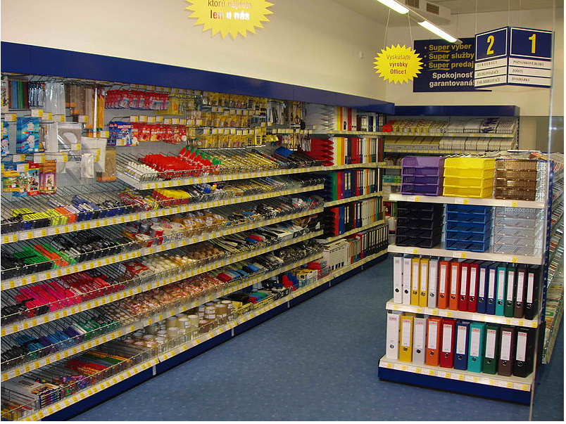

## Introduction
---
This Dashboard gives an overview of the day-day activity and sales of a company recorded between 2011-2014. The dashboard explains the inflow and outflow of the business between those years, and how the company can improve its business, develop a new model to modify and make data-driven business decisions. The requirement includes: 
-	Create a dashboard. 
- Do a Show and Tell at the end of the Sprint.
- Create a PowerPoint presentation to present the insight and recommendation

#### Types of Datasets: Sales Dataset

### Skills Demonstrated
The following features were used to generate and extract actionable insight taking into consideration the business needs and stakeholders’ requirements.
- Page navigation
- Tooltips
- Dax functions
- Quick measures.
- Drill through function.

### Source:
SharePoint.  I imported this using the URL link from the company SharePoint into Power Bi. 

### Problem statement:  

Amazing Mart has experienced loss during the year that this dataset was provided, and the growth of the company has been diminishing which has reduced the net profit and value of the company over the year 2011-2014. The problem faced has reduced the profitability of the business and the standard of the business growth This analysis intends on how the company can improve customer satisfaction, demand and retention focusing on the business needs in general. Some of the problems this Dashboard summarizes include:
1.	Profitability ratio of the company over these four years
2.	Duration of delivery according to the shipping mode.
3.	What are the sales and profit over the year?
4.	What is the country with the highest and lowest sales and profit and why?

### Data Structure:

There are two tables in this dataset known as the list of orders and orders breakdown. The unique identifier between these two is the Order ID, the orders breakdown  table which is the fact table that consists of sales, profit, discount, and quantity columns while the list of orders known as the dimensional table consists of products category, customers, and country. The table has 14 columns and 4117 while the second table has 13 columns and 8047 rows respectively

### Data transformation: 
After importing the file, it was loaded into the power query where the consistency and completeness were verified, and the data was clean and ready to use for visualization. To carry out the analysis, new calculated columns were created using the Dax function to extract some insight from the dataset that we find useful in analyzing the visualization.
- A new calculated column named year was created using the formula “year” to extract the year from the date column on the orders breakdown.
   -           Year = YEAR('List of Orders'[Order Date])
     
- Another column was created to calculate the average numbers of days it takes for delivery according to each shipping mode on the list of orders table using the formula 
  -             Delivery duration =DATEDIF ('List of Orders'[Order Date],' List of Orders'[Ship Date], DAY)
              This simply means the difference between the order date and the shipping date = Orders date – shipping dates

- A column was created on the Orders breakdown table to calculate the sales price per unit using the formula.
    -            Sales per unit = DIVIDE ('Orders Breakdown'[Sales],'Orders Breakdown'[Quantity])
                  This gives the price of each product per unit.
- A column was created on the orders breakdown table to calculate the cost of this product in each category using the formula.
    -              Cost price = 'Orders Breakdown'[Sales]-'Orders Breakdown'[Profit]
                    which simply means Sales which is also the revenue -profit =cost price
-  Another column was calculated named Sales price. B. Discount on the orders breakdown table to answer the question sales and profit before discount using the formula and created another column changing my discount 
   column to percentage.

   -              The first formula to change my discount column to percentage is:
                  Discount in % = 'Orders Breakdown'[Discount]*100
                  To calculate the sales price before the discount we must make use of the discount in %
                  Sale Price. B. Discount = 'Orders Breakdown'[Sales]*100/ (100-'Orders Breakdown'[Discount in %]).
                 This formula simply means: Discount= X
                 Original selling price= OSP
                 Selling price= SP
                 1------------ 100-DISCOUNT(X)
                 2------------- SELLING PRICE(SP)- (100-DISCOUNT(X))
                 3-------------ORIGINAL SELLING PRICE(OSP)= SELLING PRICE(SP)-(100-DISCOUNT(X)) *100

- The last column created on the orders breakdown table is named the PROFIT B. DISCOUNT which is simply
     -           Sales B. discount- Cost price=Profit and the formula used is 
                Profit B. Discount = 'Orders Breakdown'[Sale Price. B.  Discount]-' Orders Breakdown'[Cost price]
             
- A measure table was created to store the measure names ‘Measures’ separately this is to create a better understanding of all the calculations that were done in the process of extracting insight.

### Data Modelling
The model used in this analysis is the star schema model as this allows for one-to-many relationships in which a unique identifier is used to link the tables together. This model has a one-dimensional table which is the list of orders table.

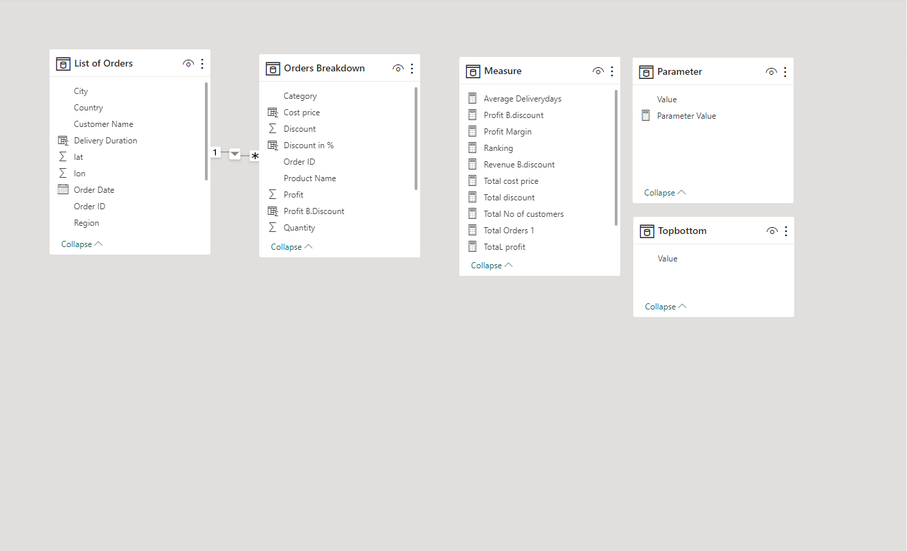

## Analysis 
Parameters were used in the analysis to filter out the countries with the top and bottom profits using the RANX formula. The value range is also between 1-15 as the dataset contains sales and profit across 15 countries.
This can be filtered using slicers. The RANX Dax function was used to rank the countries according to profit, sales, and categories.
   -                  Ranking =VAR _top profit= RANKX (ALL ('List of Orders'[Country]),'Measure'[Total profit], ,DESC)
                               VAR _bottom profit= RANKX (ALL ('List of Orders'[Country]),'Measure'[Total profit], ,ASC)
                                VAR _ranking= IF (SELECTEDVALUE (Top Bottom [Value]) = "Top"
                                 , _top profit 
                                  , _bottom profit
                                   ) RETURN
                                   IF (_ranking<=Parameter [Parameter Value],'Measure'[Total profit]
                                    ).
 This VAR MEANS Calculating the variance of a dataset. To simply understand the formula RANKX was used to rank the countries and their profit in ascending and descending order if a selected value is selected and the parameter top or bottom is selected using slicers.

 ## VISUALIZATION
 Click on this link to view my [live visualization](https://app.powerbi.com/groups/me/reports/6f4faa15-b5fb-41c6-bf8e-ff05f8982e1a/ReportSectioneb36539ae679103d20f1?experience=power-bi)
 
A page navigation tool was employed to navigate through the four pages of this analysis. 
1. Overview- This shows the inflow and outflow of the sales of the company between the given year of this dataset 2011-2014
2. Country: The analysis of the country according to their sales and profit considering the discount rate.
3. Product Category: the category of the products sold by the country displaying the quantity, sales, and profit with the delivery days 
4. Detailed page: This is a drill-through table created to give the stakeholder an in-depth of the information extracted from this data.

The following insight was derived from the dataset:
#### Profit Margin Year to year

Amazing Mart recorded sales of $2,348,482 and a profit of $ 283,240 over the year 2011-2014 that this dataset was provided, and the average profit ratio of this company is 12% which is quite low the analysis also shows the trend on this visualization how the company has been struggling with their profit margin. 
#### Total orders by year
2011                 | 2013
:-------------------:|:-------------------:
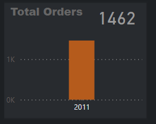        |  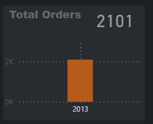
2012                 |  2014
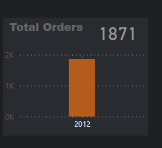        |  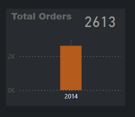

The company's profit and sales have increased over the years as well as the quantity of the products brought which is 1462 in the year 2011 to 1871 in 2012 and 2101 in 2013 and lastly 2613 but the profit ratio has been struggling which means there is a reason for the low-profit ratio if the profit is increasing. The profitability of a business has a general rule of thumb that a company's profit is considered average when its profit margin falls below 10% and it is considered high or good when it's above 20%. The company sales have increased over the years as well with $414,348 in 20111,$548,888 in 2012, $630,224 in 2013, and $755,030 in 2014.

Total sales and profit without discount
Sales                               | Profit
:----------------------------------:|:----------------------------------:
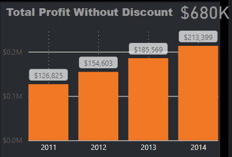| 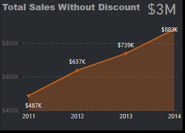

Amazing Mart has also provided us with a discount column which ranges from 0% to 90%, taking a closer look at the table and the discount given. There seems to be a huge difference between their sales and profit respectively which leads us to calculate the total sales without discount and total profit without discount which is  $680k and $3m respectively. This deduces the fact that the discount might be a reason for the low-profit ratio of the business and the company would have generated revenue without discount as well.

#### Discount rate by country

The discount rate shows the percentage of discount that was given all through the year and the rate at which it was given, the analysis reveals that the company begins to run at a loss when the discount rate is <30%.
Hence, the discount rate of each country was reviewed. 
#### Countries without Discount
 Switzerland 
 :--------------------:
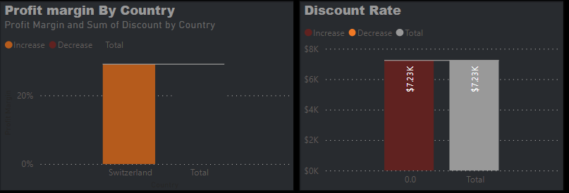
Austria
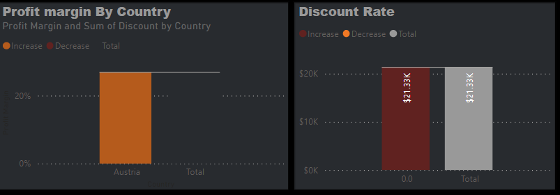
Norway                                                                                                                       

Belgium

Countries like Switzerland, Belgium, Austria, and Norway that do not give out discount has the highest profit ratio even though they did not have a high number of products sold.
#### Top Five Countries by Profit

and the top five countries according to the profit are the United Kingdom, Germany, France, Spain, and Austria. In reference to the profit margin, we can also see that some of these countries gave discounts and this emerged as the top 5. The discount rate analysis has shown that the company becomes unprofitable when it gives a discount of over 30% to the clients which implies that some of the countries that emerged as the top five gave >30% discount or 0% discount. An example of this is Austria.
#### Bottom Five Countries by Profit
Denmark
:------------------:
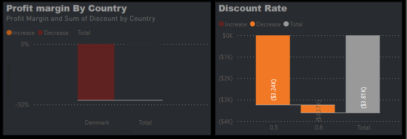
Sweden
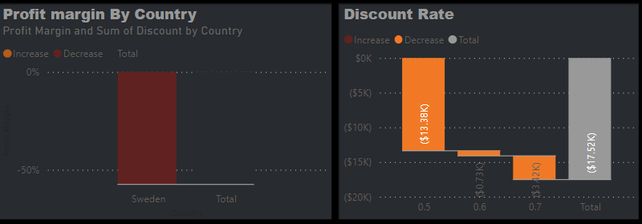
Ireland    

Portugal

Netherlands 

This led to the discount analysis. To understand the analysis, we need to know the countries that are giving out the highest discount and what their profit is over the years and this happens to be the bottom 5 countries which are Denmark {$3608}, Ireland {$6886}, Netherlands($37188}, Portugal{$8,704} and Sweden{$17254}. This analysis has provided actionable insight to make data-driven decisions for this business with more focus on the bottom five countries. It has also shown that the discount rate given by these countries is <30% hence the cause of the business loss.

#### Product Category table
(

The company has three categories of products  sold over these years. To category table gives a detailed view of the category quantity, total sales, total profit and total cost. According to the table above, office supplies has the highest sales and quantity sold which is 19902 products, cost price of $698,706 sales of $823658, and a profit of $124,952, the second product category has 5811 products sold, cost price of $777,461, sales of $886,015 and profit of $108,554 and the third products category has the lowest quantity which is 4641, cost price of $589,075, sales price of $638,809 with profit of $49,734.the table is an eye-opener to see the discount rate using the category.Apply Drill through on live visualization for further clarification.
#### Average shipping mode

The company has employed four shipping methods depending on the preference of its clients. The most used delivery days used by the customers  are the economy mode which takes a minimum of five days, the economy plus takes three days, the priority takes two days and the immediate takes a  minimum of a day. Most of the clients prefer to use the economy according to the insight derived from this dataset.

## Conclusion and Recommendation. 
They should identify and prioritize profit drivers, this can include pricing strategies, cost reduction opportunities, and operational efficiency focusing on the bottom five countries with the lowest profit.

Amazing Mart should create a direct partnership deal with organizations or wholesalers. They should offer  rewards and benefits for customers and companies that buy more at the end of each year since their products include office products and technology. 

They should consider expanding their product or service offerings, targeting different customer segments, or exploring partnerships or collaborations that can open new avenues for growth. This strategic expansion can help mitigate the impact of the loss and create new opportunities for profitability.

Amazing Mart should actively seek feedback from customers this will help them understand the customer’s needs, preferences, and pain points. Customer satisfaction attracts new customers and increases customer retention.

-----------------------
# Thank you.

